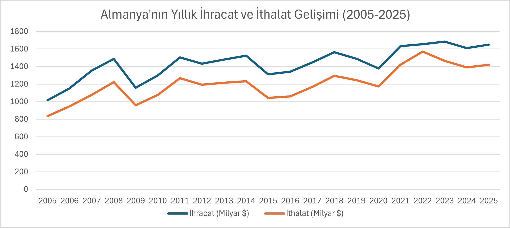

# Germany International Trade Analysis (2005-2025)

Almanya'nın son 20 yıllık dış ticaret performansı; ihracat, ithalat, dış ticaret dengesi ve ticaret hadleri gibi temel göstergeler üzerinden makroekonomik dinamikleriyle analiz edilmiştir.

---

## 1. GİRİŞ
Almanya, Avrupa Birliği'nin en büyük, dünyanın ise dördüncü büyük ekonomisi olarak küresel ticaret sisteminin en önemli aktörlerinden biridir. Alman ekonomi modelinin temel taşını, "İhracata Dayalı Büyüme" (Export-led Growth) stratejisi oluşturmaktadır. Bu çalışmada, Almanya'nın son 20 yıllık dış ticaret performansı; dışsal şokların (2008 Küresel Finans Krizi, 2020 Covid-19 Pandemisi, 2022 Enerji Krizi) etkileri veriler ışığında incelenmiştir.

---

## 2. DIŞ TİCARET SEVİYE VE DEĞİŞİM ANALİZİ

Almanya’nın dış ticaret hacmi 2005-2025 yılları arasında muazzam bir genişleme göstermiştir. 2005 yılında 1.015 milyar dolar olan toplam ihracat, nominal olarak yaklaşık %62,5 artarak 1.650 milyar dolar seviyesine ulaşmıştır.

*Kaynak: Dünya Bankası (World Bank) ve OECD Ulusal Hesaplar Veri Seti (2005-2025).*

### Kritik Kırılma Noktaları:
* **2009 Küresel Finans Krizi:** Küresel talebin daralmasıyla Almanya'nın ihracatı yıllık bazda %-22,2 ile tarihi bir düşüş yaşamıştır.
* **2020 COVID-19 Pandemisi:** Tedarik zinciri kırılmaları ve sınırların kapanması sonucu ihracatta %-7,4 oranında bir daralma kaydedilmiştir.
* **Kriz Sonrası Toparlanmalar:** 2010 (%+12,1) ve 2021 (%+18,3) yıllarında V-tipi büyüme gerçekleşmiştir.

---

## 3. DIŞ TİCARET DENGESİ VE EKONOMİK YORUM

Almanya, analiz edilen 20 yılın tamamında kronik olarak **"Dış Ticaret Fazlası"** veren bir yapıya sahiptir. Ancak 2022 yılındaki Ukrayna-Rusya savaşı sonrasında meşhur ticaret fazlası 84 milyar dolara kadar gerilemiştir.

*Kaynak: Dünya Bankası ve OECD resmi verileri kullanılarak hesaplanmıştır.*

### Miktar vs. Fiyat Ayrımı (Kritik Ekonomik Yorum)
2022 yılında Almanya'nın ihracat gelirleri nominal olarak artmaya devam etse de ithalat maliyetleri enerji krizi (doğalgaz ve petrol fiyatlarındaki aşırı artış) sebebiyle fırlamıştır. Bu durum, artışın satılan mal miktarından (reel) değil, tamamen fiyat şoklarından (nominal) kaynaklandığını gösterir ve Almanya'nın **Dış Ticaret Haddini (Terms of Trade)** ülke aleyhine ciddi şekilde bozmuştur.

---

## 4. GENEL DEĞERLENDİRME VE SONUÇ
Almanya ekonomisi yapısal olarak dış talebe ve yüksek katma değerli sanayi ihracatına bağımlıdır. Almanya'nın önümüzdeki dönemde ekonomik büyümesini istikrarlı bir patikada tutabilmesi; dış ticarette pazar çeşitliliğini artırmasına, yeşil enerji dönüşümüyle ithal enerji bağımlılığını düşürmesine ve yüksek teknolojili ürünlerdeki miktar bazlı üretim üstünlüğünü korumasına bağlıdır.

---
**Veri Kaynakları:** Resmi istatistik portalları olan Dünya Bankası (World Bank) ve OECD veri tabanları kullanılmıştır.
